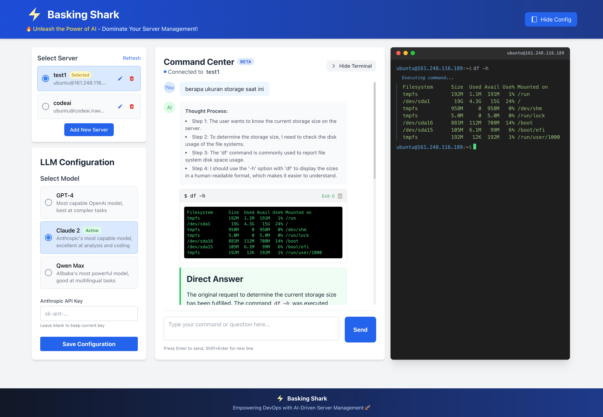

# 🦈 Basking Shark



⚡ **Unleash the Power of AI in Your Server Management!**

Basking Shark is a powerful AI-driven server management tool that lets you control your servers using natural language. No more remembering complex commands - just tell the AI what you want to do!

## ✨ Features

- 🤖 **AI-Powered Commands**: Use natural language to manage your servers
- 🧠 **Smart Reasoning**: AI breaks down complex tasks into simple steps
- 🔒 **Secure Connections**: Support for both password and SSH key authentication
- ⚡ **Real-time Execution**: Watch commands execute in real-time
- 🎯 **Multi-Model Support**: Works with OpenAI, Anthropic, and Qwen
- 🚀 **Batch Commands**: Execute multiple commands in sequence

## 🚀 Quick Start

1. **Install Dependencies**
```bash
# Install server dependencies
cd server && npm install

# Install client dependencies
cd ../client && npm install
```

2. **Configure Environment**
```bash
# Copy example config
cp .env.example .env

# Add your API keys
OPENAI_API_KEY=your_key_here
ANTHROPIC_API_KEY=your_key_here
```

3. **Build & Run**
```bash
# Build client
cd client && npm run build

# Start server
cd ../server && node index.js
```

## 💡 Usage Examples

1. **System Information**
```
Show me the disk usage and memory status
```

2. **File Operations**
```
Create a backup of the nginx config files
```

3. **Service Management**
```
Check if MySQL is running and show its status
```

4. **Batch Commands**
```
Update system packages;
Clean up old kernels;
Show system status
```

## ⚙️ Configuration

- **LLM Settings**: `server/data/llm_config.json`
- **Server Credentials**: `server/data/servers.json`
- **Environment**: `.env` file

## 🛠️ Tech Stack

- **Frontend**: Vue 3 + Vite + TailwindCSS
- **Backend**: Node.js + Express + Socket.IO
- **AI Models**: OpenAI GPT-4, Anthropic Claude, Qwen
- **Security**: SSH2 + Secure Credential Storage

## 🤝 Contributing

We love your input! We want to make contributing to Basking Shark as easy and transparent as possible, whether it's:

- 🐛 Reporting a bug
- 💡 Submitting a fix
- 🌟 Proposing new features
- 💻 Becoming a maintainer

### Development Process

1. Fork the repo and create your branch from `main`:
```bash
git clone https://github.com/your-username/basking-shark.git
cd basking-shark
git checkout -b feature/amazing-feature
```

2. Install dependencies:
```bash
# Server dependencies
cd server && npm install

# Client dependencies
cd ../client && npm install
```

3. Make your changes:
- Follow the code style
- Add tests if applicable
- Update documentation

4. Test your changes:
```bash
# Build client
cd client && npm run build

# Run server in development mode
cd ../server && npm run dev
```

5. Commit your changes:
```bash
git add .
git commit -m "feat: add amazing feature"
```

6. Push and create a pull request:
```bash
git push origin feature/amazing-feature
```

### Pull Request Process

1. Update the README.md with details of changes if needed
2. Update the version numbers following [Semantic Versioning](https://semver.org/)
3. Your PR will be merged once you have the sign-off of maintainers

### Code Style

- Use meaningful variable and function names
- Add comments for non-obvious code
- Follow Vue.js style guide for frontend
- Use ES6+ features for JavaScript
- Keep functions small and focused

### Bug Reports

When filing an issue, make sure to answer these questions:

1. What version of Node.js are you using?
2. What operating system are you using?
3. What did you do?
4. What did you expect to see?
5. What did you see instead?

### Feature Requests

We welcome feature requests! Please provide:

1. Clear description of the feature
2. Use cases and benefits
3. Possible implementation approach
4. Any relevant examples

### Community

- Be welcoming and inclusive
- Respect each other's viewpoints
- Accept constructive criticism
- Focus on what is best for the community

## 📜 License

Copyright (c) 2024 Eka Tresna Irawan <anak10thn@gmail.com>

Permission is hereby granted, free of charge, to any person obtaining a copy
of this software and associated documentation files (the "Software"), to deal
in the Software without restriction, including without limitation the rights
to use, copy, modify, merge, publish, distribute, sublicense, and/or sell
copies of the Software, and to permit persons to whom the Software is
furnished to do so, subject to the following conditions:

The above copyright notice and this permission notice shall be included in all
copies or substantial portions of the Software.

THE SOFTWARE IS PROVIDED "AS IS", WITHOUT WARRANTY OF ANY KIND, EXPRESS OR
IMPLIED, INCLUDING BUT NOT LIMITED TO THE WARRANTIES OF MERCHANTABILITY,
FITNESS FOR A PARTICULAR PURPOSE AND NONINFRINGEMENT. IN NO EVENT SHALL THE
AUTHORS OR COPYRIGHT HOLDERS BE LIABLE FOR ANY CLAIM, DAMAGES OR OTHER
LIABILITY, WHETHER IN AN ACTION OF CONTRACT, TORT OR OTHERWISE, ARISING FROM,
OUT OF OR IN CONNECTION WITH THE SOFTWARE OR THE USE OR OTHER DEALINGS IN THE
SOFTWARE.